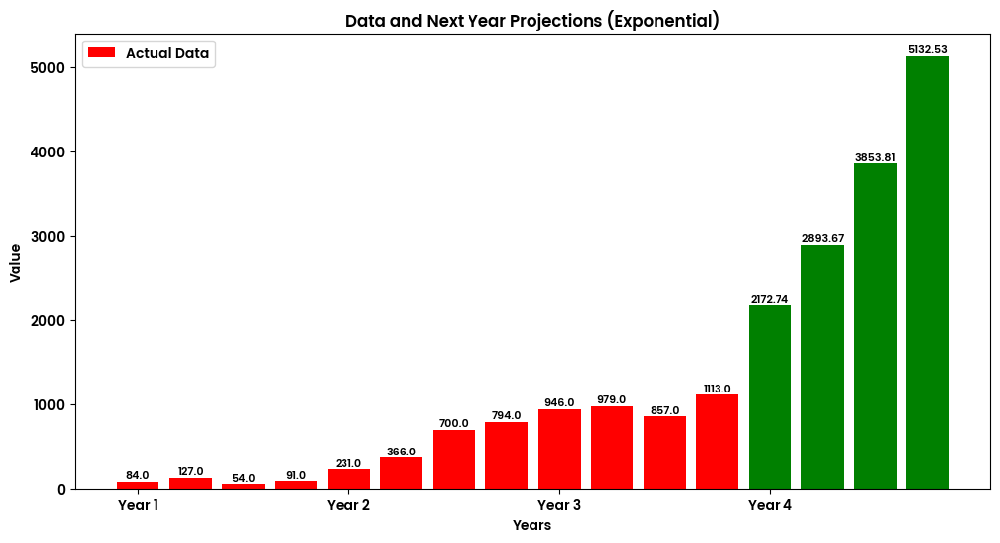

# Exponential Regression Projection

This Python script utilizes exponential regression to project future values based on historical data provided by the user. It offers a simple and intuitive interface for inputting quarterly or monthly data and generates projections for the upcoming periods.

## Usage

1. **Input Data:** The user is prompted to input either quarterly or monthly data along with the corresponding values.
2. **Projection Calculation:** The script calculates future projections using exponential regression.
3. **Visualization:** It visualizes both the actual data and the projected values using a bar chart.
4. **Display Projections:** The script also displays the future projections for the next 4 quarters or months.

## Features

- Supports both quarterly and monthly data input.
- Calculates projections using exponential regression.
- Visualizes data and projections for easy interpretation.
- Provides a clear display of future projections.

## Requirements

- Python 3.x
- NumPy (`!pip install numpy`)
- Matplotlib (`!pip install matplotlib`)

## Getting Started

1. Clone the repository: `git clone https://github.com/MobinMithun/ExponentialRegressionProjection.git`
2. Navigate to the project directory: `cd ExponentialRegressionProjection`
3. Install dependencies: `pip install -r requirements.txt`
4. Run the script: `python ExponentialRegressionProjection.py`

## Contributing

Contributions are welcome! If you have any ideas for improvements or new features, feel free to submit a pull request.
